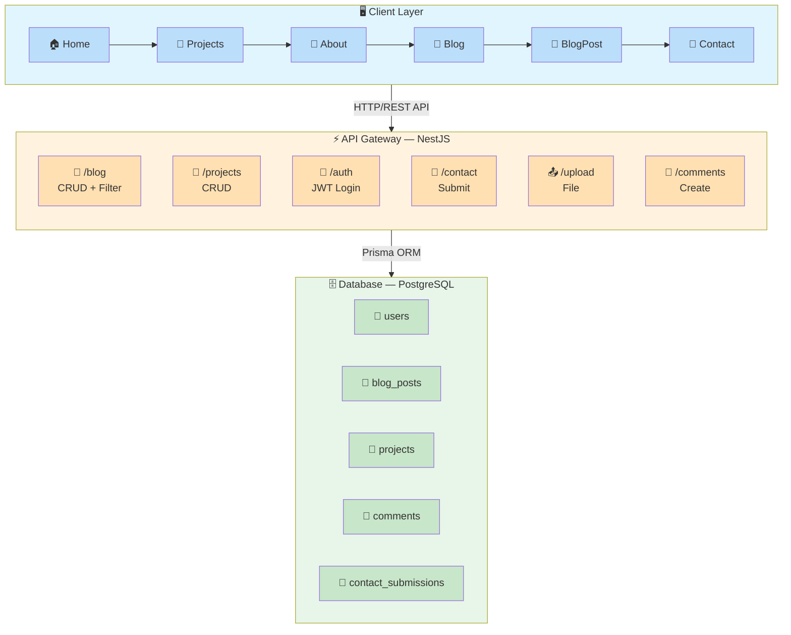
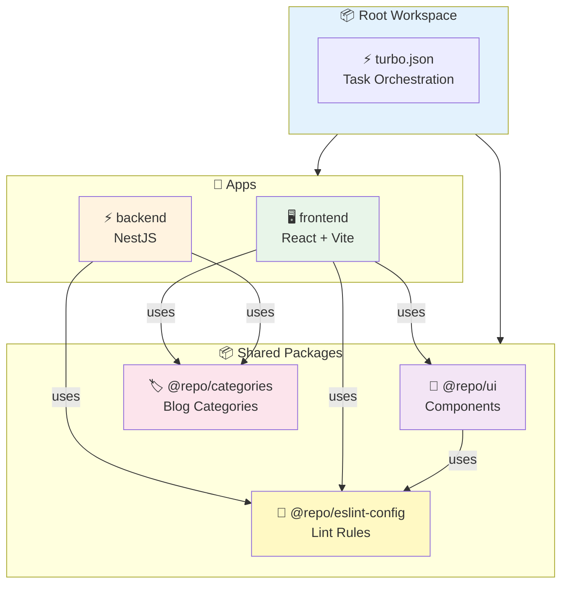
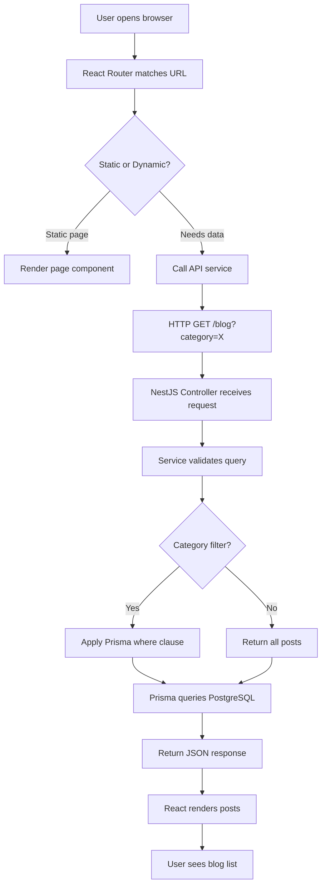
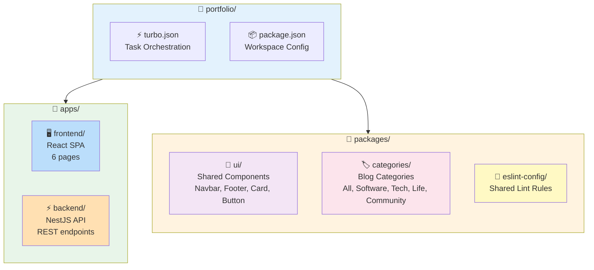
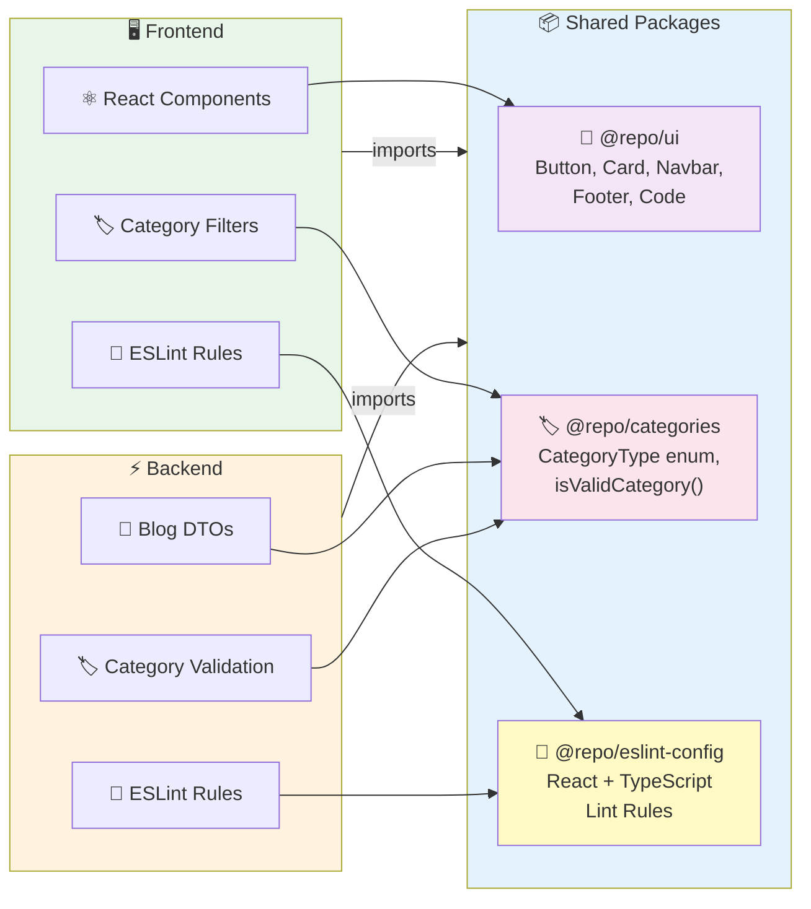

# Tiani Pekins Portfolio

A modern, full-stack portfolio platform built for showcasing engineering projects, technical blog posts, and professional contact. Designed for speed, clarity, and mobile-first browsing.

---

## Architecture Overview



### Monorepo Package Dependencies



## Request Flow



---

## Tech Stack

| Layer | Technology | Purpose |
|-------|-----------|---------|
| ⚛️ **Frontend** | React 19 + Vite | UI rendering & SPA routing |
| 🎨 **Styling** | Tailwind CSS v4 | Utility-first CSS with custom tokens |
| ✨ **Animations** | Framer Motion (`motion/react`) | Scroll-linked animations, transitions |
| ⚡ **Backend** | NestJS | Modular REST API architecture |
| 🗄️ **Database** | PostgreSQL + Prisma | Relational data with type-safe queries |
| 🔐 **Auth** | JWT + Passport | Stateless token-based admin authentication |
| 🚀 **Monorepo** | Turborepo | Shared packages, unified build pipeline |

---

## Project Structure



---

## Quick Start

### Prerequisites
- 📦 Node.js 20+
- 🗄️ PostgreSQL database

### 1️⃣ Install dependencies
```bash
yarn install
```

### 2️⃣ Environment setup
```bash
cp apps/backend/.env.example apps/backend/.env
# Edit .env and set DATABASE_URL
```

### 3️⃣ Database setup
```bash
cd apps/backend
yarn prisma migrate dev
yarn prisma db seed
```

### 4️⃣ Run the entire stack (Turborepo)
```bash
# From root — starts all packages in parallel
yarn dev
```

**What runs:**
```
@repo/categories#dev ──► Shared category package (watch mode)
@repo/ui#dev         ──► Shared UI components (watch mode)
frontend#dev         ──► Vite dev server (http://localhost:3001)
backend#dev          ──► NestJS dev server (http://localhost:3000)
```

### 5️⃣ Run individual apps
```bash
# 🖥️ Frontend only
yarn dev --filter=frontend

# ⚡ Backend only
yarn dev --filter=backend

# 📦 Shared packages only
yarn dev --filter=@repo/ui
```

---

## Build & Deploy

```bash
# 🔨 Build everything
yarn build

# 🖥️ Build specific app
yarn build --filter=frontend

# ⚡ Build backend only
yarn build --filter=backend
```

---

## Shared Packages



---

## Documentation

📚 Detailed documentation for each part of the project:

| 📖 Docs | 🔍 What you'll find |
|---------|---------------------|
| [🖥️ Frontend README](./apps/frontend/README.md) | React pages, Tailwind styling, animations, blog filter, scroll progress bar |
| [⚡ Backend README](./apps/backend/README.md) | NestJS API endpoints, database schema, auth flow, Prisma setup |
| [🏷️ Categories README](./packages/categories/README.md) | Blog category definitions (`All`, `Software`, `Tech`, `Life`, `Community`) |

---

## License

MIT — feel free to fork, learn, and build your own.

---

**Built by Tiani Pekins | Software Engineer** 🇨🇲
