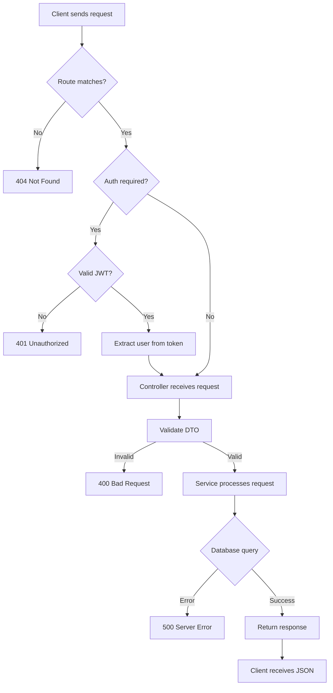
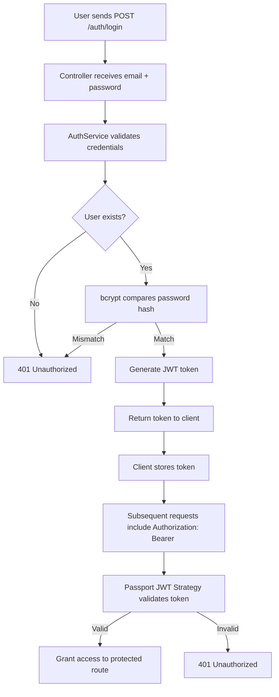

# Portfolio Backend

A **NestJS** REST API serving the portfolio frontend. Handles blog CRUD, project showcases, contact form submissions, JWT authentication, and file uploads.

---

## Architecture

```
Client (React SPA)
        │
        │ HTTP/REST
        ▼
┌─────────────────────────────────────────────────────────────┐
│                      NestJS Application                        │
│                                                                │
│  ┌─────────────────────────────────────────────────────────┐  │
│  │                    Global Middleware                     │  │
│  │  • CORS  • ValidationPipe  • JWT AuthGuard (optional)   │  │
│  └─────────────────────────────────────────────────────────┘  │
│                          │                                     │
│  ┌───────────────────────┼───────────────────────────────────┐  │
│  │                       ▼                                    │  │
│  │  ┌─────────┐  ┌─────────┐  ┌─────────┐  ┌─────────┐     │  │
│  │  │ /blog   │  │/projects│  │/contact │  │ /auth   │     │  │
│  │  │ Module  │  │ Module  │  │ Module  │  │ Module  │     │  │
│  │  └────┬────┘  └────┬────┘  └────┬────┘  └────┬────┘     │  │
│  │       │            │            │            │          │  │
│  │  ┌────┴────┐  ┌────┴────┐  ┌────┴────┐  ┌────┴────┐     │  │
│  │  │Service  │  │Service  │  │Service  │  │Service  │     │  │
│  │  │(CRUD)   │  │(CRUD)   │  │(Submit) │  │(JWT)    │     │  │
│  │  └────┬────┘  └────┬────┘  └────┬────┘  └────┬────┘     │  │
│  │       │            │            │            │          │  │
│  │  ┌────┴────┐  ┌────┴────┐  ┌────┴────┐  ┌────┴────┐     │  │
│  │  │   DTO   │  │   DTO   │  │   DTO   │  │   DTO   │     │  │
│  │  │ (Zod)   │  │ (Zod)   │  │ (Zod)   │  │ (Zod)   │     │  │
│  │  └────┬────┘  └────┬────┘  └────┬────┘  └────┬────┘     │  │
│  └───────┼────────────┼────────────┼────────────┼──────────┘  │
│          │            │            │            │             │
└──────────┼────────────┼────────────┼────────────┼─────────────┘
           │            │            │            │
           └────────────┴────────────┴────────────┘
                              │
                              ▼
                    ┌─────────────────────┐
                    │   Prisma ORM        │
                    │  (Type-safe SQL)    │
                    └──────────┬──────────┘
                               │
                               ▼
                    ┌─────────────────────┐
                    │   PostgreSQL        │
                    │   (Relational DB)   │
                    └─────────────────────┘
```

---

## API Endpoints

### Blog
```
GET    /blog              → List all posts (paginated, filterable)
GET    /blog?category=X   → Filter by category
GET    /blog/:idOrSlug    → Get single post
POST   /blog              → Create post (JWT required)
PUT    /blog/:id          → Update post (JWT required)
DELETE /blog/:id          → Delete post (JWT required)
```

### Projects
```
GET    /projects          → List all projects
POST   /projects          → Create project (JWT required)
PUT    /projects/:id      → Update project (JWT required)
DELETE /projects/:id      → Delete project (JWT required)
```

### Contact
```
POST   /contact           → Submit contact form
GET    /contact           → List submissions (JWT required)
```

### Auth
```
POST   /auth/login        → Login, returns JWT
```

### Comments
```
POST   /comments          → Create comment (public, needs approval)
```

### File Upload
```
POST   /upload            → Upload image/file (JWT required)
```

---

## Data Flow

### Blog Post Creation
```
Client POST /blog
    │
    ▼
┌─────────────────────────────────────────┐
│ AuthGuard (JWT)                         │
│    │                                    │
│    ▼                                    │
│ DTO Validation (class-validator)        │
│    │                                    │
│    ▼                                    │
│ BlogService.create()                    │
│    │                                    │
│    ├─► Check slug uniqueness            │
│    ├─► Build Prisma create input        │
│    └─► prisma.blogPost.create()         │
│         │                               │
│         ▼                               │
│    Return post with author relation     │
└─────────────────────────────────────────┘
```

## API Request Flow



---

## Database Schema

```
┌─────────────────────┐      ┌─────────────────────┐
│       User          │      │      BlogPost       │
├─────────────────────┤      ├─────────────────────┤
│ id (PK)             │      │ id (PK)             │
│ email               │      │ title               │
│ password (hash)     │      │ slug (unique)       │
│ name                │      │ content             │
│ createdAt           │      │ excerpt             │
│ updatedAt           │      │ externalUrl         │
└─────────────────────┘      │ category (String)   │
        │                    │ tags (String[])     │
        │                    │ featured (Boolean)  │
        │                    │ published (Boolean) │
        │                    │ publishedAt         │
        │                    │ createdAt           │
        │                    │ updatedAt           │
        │                    │ authorId (FK) ──────┼──► User.id
        │                    └─────────────────────┘
        │
        │                    ┌─────────────────────┐
        │                    │      Comment        │
        │                    ├─────────────────────┤
        │                    │ id (PK)             │
        │                    │ authorName          │
        │                    │ content             │
        │                    │ approved (Boolean)  │
        │                    │ createdAt           │
        │                    │ blogPostId (FK) ────┼──► BlogPost.id
        │                    └─────────────────────┘
        │
        └────────────────►┌─────────────────────┐
                          │      Project        │
                          ├─────────────────────┤
                          │ id (PK)             │
                          │ title               │
                          │ slug (unique)       │
                          │ description         │
                          │ technologies (Str[])│
                          │ thumbnail           │
                          │ demoUrl             │
                          │ gitUrl              │
                          │ featured (Boolean)  │
                          │ authorId (FK) ──────┼──► User.id
                          └─────────────────────┘
```

---

## Tech Stack

| Tech | Version | Purpose |
|------|---------|---------|
| NestJS | 10 | Framework, DI, modular architecture |
| Prisma | 6 | ORM, type-safe queries, migrations |
| PostgreSQL | 15+ | Relational database |
| JWT | — | Stateless auth tokens |
| Passport | — | Auth strategies |
| class-validator | — | DTO validation |
| Swagger | — | API documentation |
| bcrypt | — | Password hashing |

---

## Folder Structure

```
backend/
├── prisma/
│   ├── schema.prisma         ← Database schema
│   └── seed.ts               ← Seed data (admin user, blog posts, projects)
│
├── src/
│   ├── blog/
│   │   ├── blog.controller.ts    ← Route handlers
│   │   ├── blog.service.ts       ← Business logic
│   │   ├── blog.module.ts        ← Module definition
│   │   └── dto/
│   │       └── blog.dto.ts       ← Create/Update/Query DTOs
│   │
│   ├── projects/
│   │   ├── projects.controller.ts
│   │   ├── projects.service.ts
│   │   ├── projects.module.ts
│   │   └── dto/
│   │       └── project.dto.ts
│   │
│   ├── contact/
│   │   ├── contact.controller.ts
│   │   ├── contact.service.ts
│   │   └── dto/
│   │       └── contact.dto.ts
│   │
│   ├── auth/
│   │   ├── auth.controller.ts
│   │   ├── auth.service.ts
│   │   ├── auth.module.ts
│   │   └── strategies/
│   │       └── jwt.strategy.ts
│   │
│   ├── comments/
│   │   ├── comments.controller.ts
│   │   ├── comments.service.ts
│   │   └── dto/
│   │       └── comment.dto.ts
│   │
│   ├── file-upload/
│   │   ├── file-upload.controller.ts
│   │   └── file-upload.service.ts
│   │
│   ├── prisma/
│   │   ├── prisma.module.ts
│   │   └── prisma.service.ts
│   │
│   ├── main.ts                   ← Entry point
│   └── app.module.ts             ← Root module
│
├── test/
│   └── app.e2e-spec.ts           ← End-to-end tests
│
├── package.json
└── tsconfig.json
```

---

## Development

```bash
# Install dependencies (from root or backend dir)
yarn install

# Environment setup
cp .env.example .env
# Edit .env — set DATABASE_URL, JWT_SECRET
# (Database URL is private — never commit this file)

# Database
yarn prisma migrate dev
yarn prisma db seed

# Run dev server (via Turborepo)
yarn dev --filter=backend

# Run tests
yarn test --filter=backend
yarn test:e2e --filter=backend
```

---

## Authentication

```
┌─────────────┐
│   Login     │
│  (email,    │
│  password)  │
└──────┬──────┘
       │
       ▼
┌─────────────┐
│   Auth      │
│   Service   │
│  • Validate │
│    password │
│    (bcrypt) │
│  • Sign JWT │
└──────┬──────┘
       │
       ▼
┌─────────────┐
│   JWT Token │
│   (1 day)   │
└──────┬──────┘
       │
       ▼
┌─────────────────────────────┐
│   Protected Routes          │
│   Authorization: Bearer <jwt>│
│   • POST /blog              │
│   • PUT /blog/:id           │
│   • DELETE /blog/:id        │
│   • POST /projects          │
│   • POST /upload            │
└─────────────────────────────┘
```

---

## Auth Flow



---

## Blog Categories

Valid category values (enforced by DTO):
```
All         ──► View all posts
Software    ──► Software engineering, architecture, patterns
Tech        ──► General technology, tools, trends
Life        ──► Personal, career, culture
Community   ──► Open source, events, ecosystem
```

> Stored as plain `String` in PostgreSQL — no migration needed to add new categories.

---

## Notes for Reviewers

- **Prisma client is generated** inside `src/generated/prisma/` — do not edit manually.
- **DTOs use class-validator** for runtime type checking, not just TypeScript.
- **All services return Prisma-select optimized data** — no over-fetching.
- **E2E tests use the real database** — ensure `DATABASE_URL` is set before running.
- **Comments are moderated** — `approved: false` by default, admin can approve.

---

**Maintained by Tiani Pekins | Backend Engineer** 🇨🇲
