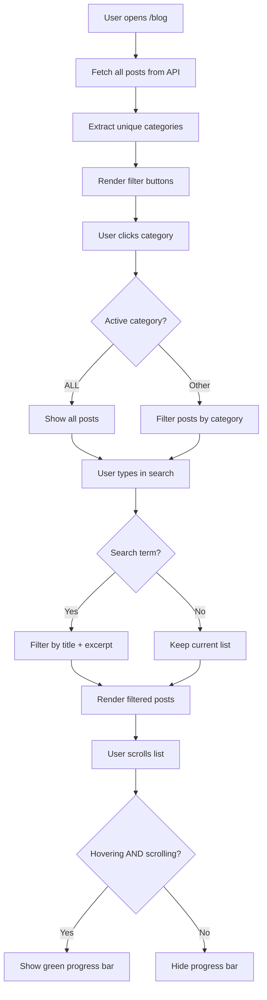

# Portfolio Frontend

The **React 19** single-page application powering the public portfolio. Designed for smooth navigation, scroll-linked animations, and a reading-first blog experience.

---

## Architecture

```
User Browser
      │
      ▼
┌─────────────────────────────────────────────┐
│             Vite Dev Server                  │
│  ┌─────────────────────────────────────────┐ │
│  │           React Router                   │ │
│  │  ┌─────────┐  ┌─────────┐  ┌─────────┐ │ │
│  │  │   /     │  │/projects│  │  /about │ │ │
│  │  │ (Home)  │  │(Projects│  │ (About) │ │ │
│  │  └────┬────┘  └────┬────┘  └────┬────┘ │ │
│  │  ┌─────────┐  ┌─────────┐  ┌─────────┐ │ │
│  │  │  /blog  │  │/blog/:id│  │/contact │ │ │
│  │  │ (Blog)  │  │(BlogPost│  │(Contact)│ │ │
│  │  └────┬────┘  └────┬────┘  └────┬────┘ │ │
│  └───────┼──────────┼──────────┼─────────┘ │
└──────────┼──────────┼──────────┼───────────┘
           │          │          │
           ▼          ▼          ▼
    ┌────────────┐ ┌────────────┐ ┌────────────┐
    │   Layout   │ │   Layout   │ │   Layout   │
    │  (Navbar)  │ │  (Navbar)  │ │  (Footer)  │
    │  (Footer)  │ │  (Footer)  │ │            │
    └────────────┘ └────────────┘ └────────────┘
           │
           ▼
    ┌────────────────────────────────────────┐
    │           API Service Layer             │
    │         (src/services/api.ts)            │
    │  ┌────────────┐  ┌──────────────────┐   │
    │  │ getBlogPosts│  │ getBlogPost(id)   │   │
    │  │ getProjects │  │ submitContact()    │   │
    │  └────────────┘  └──────────────────┘   │
    │           │                            │
    │           ▼                            │
    │    HTTP ───► Backend API (env: VITE_API_URL)│
    └────────────────────────────────────────┘
```

---

## Pages

| Route | Page | Key Features |
|-------|------|--------------|
| `/` | **Home** | Hero intro, featured projects, latest blog posts, GSAP scroll animations |
| `/projects` | **Projects** | Grid of all projects with tech stack tags |
| `/about` | **About** | Bio, skills, experience timeline |
| `/blog` | **Blog** | Category filter (All → Software → Tech → Life → Community), search bar, vertical scroll progress indicator |
| `/blog/:id` | **BlogPost** | Full article, comments section, like counter |
| `/contact` | **Contact** | Contact form with validation |

---

## Key Features

### Blog Category Filter
```
[ALL] ──► [SOFTWARE] ──► [TECH] ──► [LIFE] ──► [COMMUNITY]
   │
   └── Search bar (title + excerpt)
```

**Active category**: Green pill (`bg-primary` = `#2e7d32`)
**Inactive category**: White outline pill

### Scroll Progress Indicator
```
Blog Page (hover + scroll triggers)
┌─────────────────────────────────────────┐
│                                         │
│  ┌──┐                                   │
│  │██│ ← Green bar (grows with scroll)   │
│  │  │                                   │
│  │  │  ┌──────────────────────────┐    │
│  │  │  │ Post 1                   │    │
│  │  │  │ Post 2                   │    │
│  │  │  │ Post 3                   │    │
│  │  │  │ Post 4                   │    │
│  │  │  │ ...                      │    │
│  └──┘  └──────────────────────────┘    │
│                                         │
└─────────────────────────────────────────┘
```

- **Visible only when**: `hovering` AND `scrolling`
- **Height**: 960px fixed bar
- **List height**: 1400px (shows ~4 posts at a time)

## Blog Filter Flow



---

## Tech Stack

| Tech | Version | Purpose |
|------|---------|---------|
| React | 19 | UI framework |
| Vite | 6 | Build tool + dev server |
| React Router | 7 | Client-side routing |
| Tailwind CSS | 4 | Utility-first styling |
| Framer Motion | `motion/react` | Animations, scroll-linked effects |
| Lucide React | — | Icon library |
| Axios (via fetch) | Native | API calls |

---

## Styling System

### Custom Design Tokens (`src/index.css`)
```
--color-primary: #2e7d32          (Green)
--color-primary-light: #f1f8f1     (Light green bg)
--color-bg-primary: #ffffff        (White)
--color-bg-secondary: #fafafa      (Off-white)
--color-text-primary: #000000      (Black)
--color-text-secondary: #666666    (Gray)
--color-card: #ffffff              (Card bg)
--color-border-subtle: #eeeeee     (Light borders)
```

### Typography
- **Display**: Poppins (headings, hero text)
- **Body**: Inter (paragraphs, UI text)
- **Script**: Cedarville Cursive (accents)

---

## Folder Structure

```
frontend/
├── public/                 ← Static assets
├── src/
│   ├── pages/
│   │   ├── Home.tsx          ← Landing page with GSAP
│   │   ├── Blog.tsx          ← Category filter + post list
│   │   ├── BlogPost.tsx      ← Single article + comments
│   │   ├── Projects.tsx      ← Project grid
│   │   ├── About.tsx         ← Bio page
│   │   └── Contact.tsx       ← Contact form
│   │
│   ├── components/
│   │   └── Layout.tsx        ← Navbar + Footer wrapper
│   │
│   ├── services/
│   │   └── api.ts            ← API client functions
│   │
│   ├── App.tsx               ← Router setup
│   ├── main.tsx              ← Entry point
│   └── index.css             ← Tailwind tokens + custom classes
│
├── index.html
├── vite.config.ts
└── package.json
```

---

## Development

```bash
# Start dev server (via Turborepo)
yarn dev --filter=frontend

# Build for production
yarn build --filter=frontend

# Preview production build
yarn preview --filter=frontend
```

---

## API Integration

```
Frontend (Vite proxy or env var)
         │
         │ fetch()
         ▼
    Backend API
    (URL configured via VITE_API_URL env var)
         │
         ├─► GET  /blog?page=1&limit=10
         ├─► GET  /blog/:slug
         ├─► GET  /projects
         ├─► POST /contact
         └─► POST /auth/login
```

**Environment variable (in `.env`):**
```
# Development
VITE_API_URL=http://localhost:3000

# Production (private — set in deployment platform)
# VITE_API_URL=https://your-backend-url.com
```

---

## Notes for Reviewers

- **No global state library**: React `useState` + `useEffect` are sufficient for this scale.
- **No CSS-in-JS**: Tailwind + custom CSS classes keep it fast and cache-friendly.
- **API calls use native `fetch`**: Lightweight, no extra bundle size.
- **Animations are GPU-optimized**: `transform` and `opacity` only, no layout thrashing.

---

**Maintained by Tiani Pekins | Frontend Engineer** 🇨🇲
