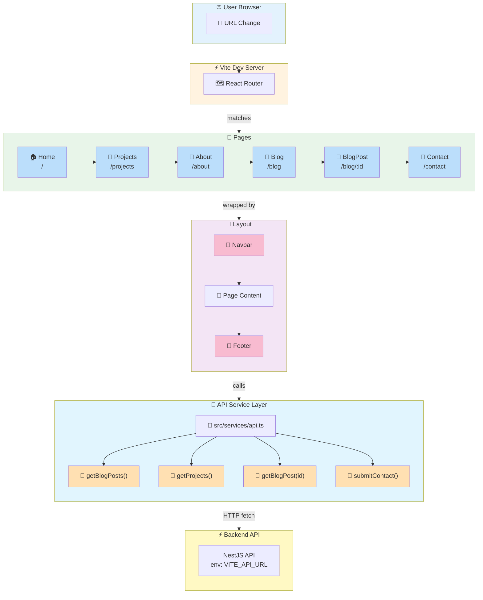
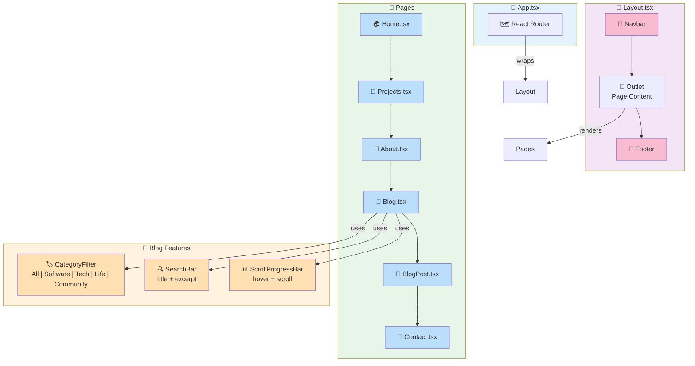
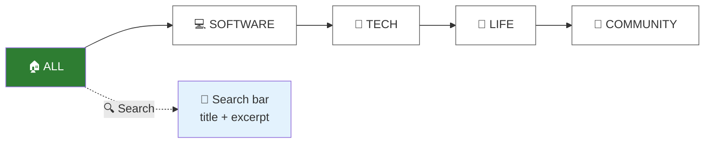
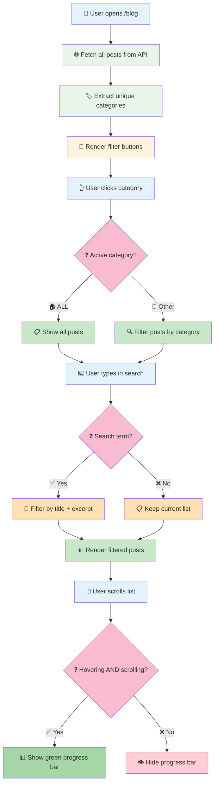

# Portfolio Frontend

The **React 19** single-page application powering the public portfolio. Designed for smooth navigation, scroll-linked animations, and a reading-first blog experience.

---

## Application Architecture



## Component Hierarchy



---

## Pages

| Route | Page | Key Features |
|-------|------|--------------|
| `/` | 🏠 **Home** | Hero intro, featured projects, latest blog posts, GSAP scroll animations |
| `/projects` | 📁 **Projects** | Grid of all projects with tech stack tags |
| `/about` | 👤 **About** | Bio, skills, experience timeline |
| `/blog` | 📝 **Blog** | Category filter (All → Software → Tech → Life → Community), search bar, vertical scroll progress indicator |
| `/blog/:id` | 📄 **BlogPost** | Full article, comments section, like counter |
| `/contact` | 📨 **Contact** | Contact form with validation |

---

## 🎯 Key Features

### 🏷️ Blog Category Filter



- 🟢 **Active category**: Green pill (`bg-primary` = `#2e7d32`)
- ⚪ **Inactive category**: White outline pill

### 📊 Scroll Progress Indicator

```
📝 Blog Page (hover + scroll triggers)
┌─────────────────────────────────────────┐
│                                         │
│  ┌──┐                                   │
│  │🟢│ ← Green bar (grows with scroll)   │
│  │  │                                   │
│  │  │  ┌──────────────────────────┐    │
│  │  │  │ 📄 Post 1                │    │
│  │  │  │ 📄 Post 2                │    │
│  │  │  │ 📄 Post 3                │    │
│  │  │  │ 📄 Post 4                │    │
│  │  │  │ 📄 ...                   │    │
│  └──┘  └──────────────────────────┘    │
│                                         │
└─────────────────────────────────────────┘
```

- 👁️ **Visible only when**: `hovering` AND `scrolling`
- 📏 **Height**: 960px fixed bar
- 📋 **List height**: 1400px (shows ~4 posts at a time)

## Blog Filter Flow



---

## Tech Stack

| Tech | Version | Purpose |
|------|---------|---------|
| ⚛️ React | 19 | UI framework |
| ⚡ Vite | 6 | Build tool + dev server |
| 🗺️ React Router | 7 | Client-side routing |
| 🎨 Tailwind CSS | 4 | Utility-first styling |
| ✨ Framer Motion | `motion/react` | Animations, scroll-linked effects |
| 🔣 Lucide React | — | Icon library |
| 🌐 Native fetch | — | API calls |

---

## 🎨 Styling System

### Custom Design Tokens (`src/index.css`)

| 🎯 Token | 🎨 Value | 💡 Usage |
|----------|----------|----------|
| `--color-primary` | `#2e7d32` 🟢 | Green — buttons, active states, links |
| `--color-primary-light` | `#f1f8f1` 🟩 | Light green background |
| `--color-bg-primary` | `#ffffff` ⬜ | White — main background |
| `--color-bg-secondary` | `#fafafa` ⬜ | Off-white — secondary bg |
| `--color-text-primary` | `#000000` ⬛ | Black — headings |
| `--color-text-secondary` | `#666666` 🔘 | Gray — body text |
| `--color-card` | `#ffffff` ⬜ | Card background |
| `--color-border-subtle` | `#eeeeee` 🔘 | Light borders |

### 🔤 Typography
- 🖋️ **Display**: Poppins (headings, hero text)
- 📝 **Body**: Inter (paragraphs, UI text)
- ✍️ **Script**: Cedarville Cursive (accents)

---

## Folder Structure

```
frontend/
├── public/                 ← Static assets
├── src/
│   ├── pages/
│   │   ├── Home.tsx          ← Landing page with GSAP
│   │   ├── Blog.tsx          ← Category filter + post list
│   │   ├── BlogPost.tsx      ← Single article + comments
│   │   ├── Projects.tsx      ← Project grid
│   │   ├── About.tsx         ← Bio page
│   │   └── Contact.tsx       ← Contact form
│   │
│   ├── components/
│   │   └── Layout.tsx        ← Navbar + Footer wrapper
│   │
│   ├── services/
│   │   └── api.ts            ← API client functions
│   │
│   ├── App.tsx               ← Router setup
│   ├── main.tsx              ← Entry point
│   └── index.css             ← Tailwind tokens + custom classes
│
├── index.html
├── vite.config.ts
└── package.json
```

---

## Development

```bash
# ▶️ Start dev server (via Turborepo)
yarn dev --filter=frontend

# 🔨 Build for production
yarn build --filter=frontend

# 👁️ Preview production build
yarn preview --filter=frontend
```

---

## 🌐 API Integration

```mermaid
flowchart TB
    subgraph FE["🖥️ Frontend"]
        direction TB
        Vite["⚡ Vite Dev Server"]
        Env["🔧 .env"]
    end

    subgraph API["🔌 API Calls"]
        direction TB
        G1["📥 GET /blog?page=1&limit=10"]
        G2["📥 GET /blog/:slug"]
        G3["📥 GET /projects"]
        P1["📤 POST /contact"]
        P2["📤 POST /auth/login"]
    end

    subgraph BE["⚡ Backend"]
        direction TB
        Nest["🚀 NestJS API"]
    end

    FE -->|fetch()| API
    API -->|HTTP| BE
    Env -->|VITE_API_URL| FE

    style FE fill:#e8f5e9
    style API fill:#e1f5fe
    style BE fill:#fff3e0
    style Vite fill:#c8e6c9
    style Env fill:#fff9c4
    style Nest fill:#ffe0b2
    style G1 fill:#bbdefb
    style G2 fill:#bbdefb
    style G3 fill:#bbdefb
    style P1 fill:#f8bbd0
    style P2 fill:#f8bbd0
```

**🔧 Environment variable (in `.env`):**
```
# 🖥️ Development
VITE_API_URL=http://localhost:3000

# 🚀 Production (private — set in deployment platform)
# VITE_API_URL=https://your-backend-url.com
```

---

## 📝 Notes for Reviewers

- 🧠 **No global state library**: React `useState` + `useEffect` are sufficient for this scale.
- 🎨 **No CSS-in-JS**: Tailwind + custom CSS classes keep it fast and cache-friendly.
- 🌐 **API calls use native `fetch`**: Lightweight, no extra bundle size.
- ✨ **Animations are GPU-optimized**: `transform` and `opacity` only, no layout thrashing.

---

**Maintained by Tiani Pekins | Frontend Engineer** 🇨🇲
