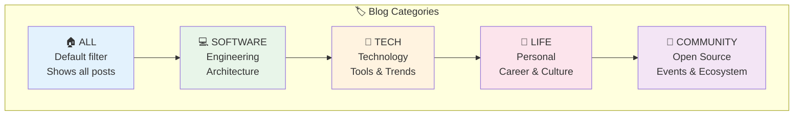
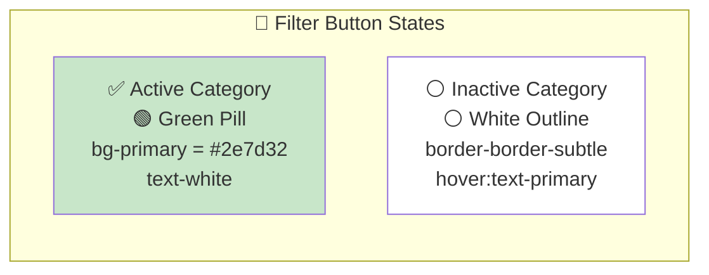
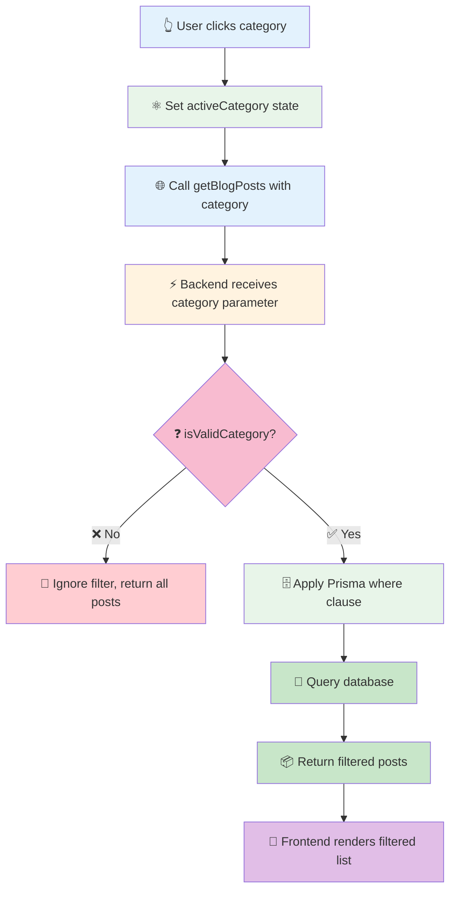

# @repo/categories

Shared category definitions for the portfolio blog. Used across **frontend** and **backend** to ensure consistency.

---

## Category System



### Category Filter States



---

## 💻 Usage

### ⚛️ Frontend (React)
```tsx
import { CategoryType, isValidCategory } from "@repo/categories";

// 🎨 Static list for filter buttons
const categories = ["All", "Software", "Tech", "Life", "Community"];

// ✅ Validate API response
const cat = apiResponse.category;
if (isValidCategory(cat)) {
  setActiveCategory(cat);
}
```

### ⚡ Backend (NestJS)
```ts
import { CategoryType } from "@repo/categories";

// 📝 In DTO
@IsEnum(CategoryType)
category!: CategoryType;

// 🗄️ In service
if (query.category) {
  where.category = query.category;
}
```

---

## Exports

| Export | Type | Description |
|--------|------|-------------|
| 🏷️ `CategoryType` | `const` / `type` | Enum object and TypeScript type |
| ✅ `isValidCategory` | `function` | Type guard: checks if value is a valid category |
| 📝 `getCategoryLabel` | `function` | Maps enum key to display string |

## Category Validation Flow



---

## Category Change History

```
Previous: All, Software, Tech, Life, Programming
Current:  All, Software, Tech, Life, Community
                              │
                              ▼
                    "Programming" replaced by "Community"
```

> **Note**: The database stores `category` as a plain `String`, so no migration is required when updating the enum. Only posts with the old category value (`"Programming"`) will no longer have a dedicated filter button — they will still appear under the **"All"** filter.

---

**Maintained by Tiani Pekins** 🇨🇲
